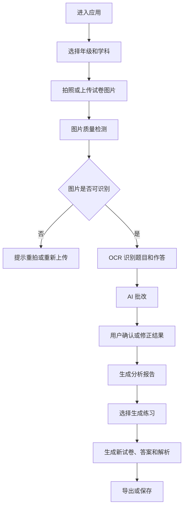

# Paper Analyzer PRD

## 1. 产品概述

Paper Analyzer 是一款面向学生、家长和老师的试卷批改与个性化练习工具。用户选择年级和学科后，拍照上传学生已完成的试卷，系统自动识别题目与作答内容，完成批改、错因分析、知识点诊断，并基于薄弱点生成新的针对性练习试卷。

MVP 目标是验证从“上传试卷”到“生成个性化练习”的完整闭环，优先支持单个学生、单份试卷、拍照上传、AI 辅助批改、结果分析和新试卷生成。

## 2. 产品目标

### 2.1 业务目标

- 降低家长和老师批改试卷、整理错题、出针对性练习的时间成本。
- 帮助学生看清薄弱知识点，而不只是知道哪道题错了。
- 建立可持续积累的学生学习画像，为后续个性化学习推荐打基础。

### 2.2 用户目标

- 用户可以快速上传一份学生做完的试卷。
- 用户可以得到清晰可信的批改结果。
- 用户可以看到按知识点、题型、难度聚合的分析。
- 用户可以一键生成一份新的针对性练习试卷，并可导出打印。

### 2.3 MVP 成功指标

- 用户从进入页面到完成试卷上传的时间小于 2 分钟。
- 单份试卷批改结果可在 3 分钟内生成。
- 用户可手动修正 AI 批改结果。
- 系统能基于错题生成至少 1 份新的练习试卷。
- 生成的新试卷包含题目、答案和解析。

## 3. 目标用户

### 3.1 家长

核心场景是课后检查孩子试卷，想知道孩子真正薄弱在哪里，并快速拿到同类练习。

### 3.2 老师

核心场景是批量了解学生试卷表现，查看班级共性问题，并生成补弱练习。MVP 暂不优先做班级批量能力，但数据结构需要预留扩展。

### 3.3 学生

核心场景是查看自己的错题、错因和推荐练习。MVP 以家长或老师代操作为主，学生端体验作为后续版本。

## 4. 使用场景

### 4.1 家长上传孩子试卷

1. 用户进入应用。
2. 选择年级、学科。
3. 拍照或选择图片上传学生做完的试卷。
4. 系统识别试卷内容和学生答案。
5. 用户确认或补充必要信息。
6. 系统给出批改结果和分析报告。
7. 用户生成新的针对性练习试卷。
8. 用户下载或打印试卷及答案解析。

### 4.2 老师快速诊断单个学生

1. 老师选择学生、年级、学科。
2. 上传学生试卷图片。
3. 查看批改结果和知识点分析。
4. 选择薄弱知识点生成练习。
5. 将练习发给学生。

## 5. 产品范围

### 5.1 MVP 范围

- 年级、学科选择。
- 单份试卷图片上传。
- 多张图片合并为同一份试卷。
- 图片质量检测和上传状态展示。
- OCR 识别试卷题目、学生答案和可见批改痕迹。
- AI 批改。
- 用户手动修正识别内容和批改结果。
- 错题、知识点、题型和难度分析。
- 个性化练习试卷生成。
- 试卷、答案、解析导出。
- 历史记录列表。

### 5.2 暂不纳入 MVP

- 班级批量上传和批量分析。
- 长期学习路径规划。
- 学生账号体系和多端同步。
- 自动识别教材版本。
- 视频讲解。
- 复杂公式手写识别的高精度保证。
- 与学校教务系统打通。

## 6. 核心流程

## 7. 功能需求

### 7.1 年级和学科选择

用户进入核心流程前必须选择年级和学科。

必填字段：

- 年级：小学一年级至高中三年级。
- 学科：语文、数学、英语、物理、化学、生物、历史、地理、政治。

MVP 优先建议：

- 第一阶段优先支持数学和英语。
- 年级范围优先支持小学三年级至初中三年级。

验收标准：

- 未选择年级或学科时不能进入上传流程。
- 选择结果会影响后续识别、批改、知识点映射和出题难度。

### 7.2 试卷上传

用户可以通过拍照或本地选择图片上传试卷。

支持能力：

- 支持 JPG、PNG、HEIC。
- 支持单张或多张图片。
- 支持用户调整图片顺序。
- 支持删除已上传图片。
- 支持上传进度和失败重试。

图片质量检测：

- 检测模糊、过暗、反光、页面缺失、倾斜严重。
- 对低质量图片给出明确提示。
- 不强制拦截所有低质量图片，但需要提示识别准确率可能下降。

验收标准：

- 用户可以上传一份由多张图片组成的试卷。
- 图片上传失败时有可理解的错误提示。
- 系统能提示明显不可识别的图片。

### 7.3 OCR 与试卷结构化

系统需要从试卷图片中识别：

- 题目序号。
- 题干。
- 选项。
- 学生答案。
- 填空内容。
- 解题过程。
- 老师已有批改痕迹。
- 分值信息。

结构化输出：

- 将试卷拆分为题目列表。
- 每道题包含题干、答案区域、学生作答、题型、分值和图片定位信息。
- 无法确定的内容标记为待确认。

验收标准：

- 用户能查看系统识别出的题目列表。
- 对低置信度内容，界面需要突出提示用户确认。
- 用户可以编辑题干、学生答案和题型。

### 7.4 AI 批改

系统基于年级、学科、题目内容和学生答案进行批改。

批改结果包括：

- 正确、错误、部分正确、无法判断。
- 得分。
- 标准答案。
- 简要解析。
- 错因标签。
- 关联知识点。
- 置信度。

错因标签示例：

- 概念不清。
- 审题错误。
- 计算错误。
- 公式使用错误。
- 语法错误。
- 拼写错误。
- 步骤不完整。
- 表达不规范。

人工修正：

- 用户可以修改每题的正确性、得分、标准答案、解析和知识点。
- 用户修正后，分析报告需要同步更新。

验收标准：

- 每道题都必须有批改状态。
- 低置信度题目必须提示用户复核。
- 用户修正单题结果后，总分和知识点分析自动刷新。

### 7.5 分析报告

报告需要让用户快速理解学生表现。

报告内容：

- 总分、得分率、正确率。
- 题型表现。
- 知识点掌握情况。
- 错题列表。
- 高频错因。
- 推荐练习方向。

知识点分析：

- 每个知识点展示掌握状态：已掌握、需巩固、薄弱。
- 展示关联错题数量和代表题。
- 给出简短学习建议。

验收标准：

- 用户能在一个页面看到本次试卷的整体表现。
- 用户能从知识点进入关联错题。
- 用户能选择一个或多个薄弱知识点生成练习。

### 7.6 个性化试卷生成

用户可以基于分析结果生成新的练习试卷。

生成配置：

- 选择知识点范围。
- 选择题目数量。
- 选择难度：基础、巩固、提升。
- 选择题型。
- 是否包含同类变式题。
- 是否包含综合题。

生成结果：

- 新试卷标题。
- 题目列表。
- 分值。
- 答题区域。
- 答案。
- 解析。
- 对应知识点。

验收标准：

- 系统可以基于薄弱知识点生成一份新试卷。
- 新试卷不能简单复用原试卷题目原文。
- 用户可以重新生成。
- 用户可以导出学生版和答案解析版。

### 7.7 历史记录

用户可以查看历史上传与生成记录。

记录内容：

- 学生名称，MVP 可选。
- 年级。
- 学科。
- 上传时间。
- 批改状态。
- 得分率。
- 生成练习入口。

验收标准：

- 用户可以从历史记录重新打开分析报告。
- 用户可以从历史记录重新下载生成过的试卷。

## 8. 页面需求

### 8.1 首页 / 工作台

核心元素：

- 年级选择。
- 学科选择。
- 上传入口。
- 最近记录。

### 8.2 上传页

核心元素：

- 图片上传区域。
- 图片预览列表。
- 图片排序。
- 删除图片。
- 上传状态。
- 识别按钮。

### 8.3 识别确认页

核心元素：

- 原图预览。
- 题目结构化列表。
- 低置信度提示。
- 编辑入口。
- 开始批改按钮。

### 8.4 批改结果页

核心元素：

- 总分和正确率。
- 单题批改结果。
- 标准答案和解析。
- 人工修正入口。
- 进入分析报告按钮。

### 8.5 分析报告页

核心元素：

- 总体表现。
- 知识点掌握情况。
- 错题列表。
- 高频错因。
- 生成练习按钮。

### 8.6 生成试卷页

核心元素：

- 生成配置。
- 题目预览。
- 重新生成。
- 导出学生版。
- 导出答案解析版。

## 9. 数据模型草案

### 9.1 Paper

- id
- grade
- subject
- title
- imageIds
- status
- totalScore
- studentScore
- createdAt
- updatedAt

### 9.2 PaperImage

- id
- paperId
- url
- order
- qualityStatus
- qualityWarnings
- createdAt

### 9.3 Question

- id
- paperId
- number
- type
- stem
- options
- studentAnswer
- standardAnswer
- score
- studentScore
- gradingStatus
- knowledgePoints
- errorTags
- explanation
- confidence
- sourceRegion

### 9.4 AnalysisReport

- id
- paperId
- summary
- knowledgePointStats
- questionTypeStats
- errorTagStats
- recommendations
- createdAt

### 9.5 GeneratedPaper

- id
- sourcePaperId
- grade
- subject
- title
- config
- questions
- answerKey
- createdAt

## 10. AI 能力要求

### 10.1 技术选型

MVP 直接接入 OpenAI GPT 多模态模型，不单独接入第三方 OCR 服务。试卷图片识别、结构化抽取、批改分析和新试卷生成都优先通过 GPT 完成。

接入要求：

- 首次打开应用时检测 API key，未配置则自动进入配置页。
- API key 由用户在页面配置，保存在当前浏览器本地存储中。
- API key 不写入代码、README 或 Git 仓库。
- 前端将 API key 随业务请求发送给后端代理，后端不持久化保存。
- 前端不直接请求 OpenAI API，避免浏览器跨域和接口封装问题。
- 后端需要记录每次 AI 任务的状态、错误信息和可重试入口。
- 模型输出必须经过 JSON 结构校验后再进入业务数据。

### 10.2 识别模型

需要支持图片 OCR、版面理解和手写内容识别。

关键要求：

- 输出结构化 JSON。
- 每个字段包含置信度。
- 保留无法识别的标记。
- 支持原图区域定位，便于用户回看。

### 10.3 批改模型

需要结合年级和学科进行批改。

关键要求：

- 不确定时输出无法判断，而不是强行批改。
- 给出简洁、可解释的判分依据。
- 对主观题和过程题输出置信度。
- 支持用户修正结果后重新生成分析。

### 10.4 出题模型

需要基于薄弱知识点生成新题。

关键要求：

- 题目难度匹配年级。
- 题目覆盖用户选择的知识点。
- 避免直接复制原题。
- 输出答案和解析。
- 输出可打印格式。

## 11. 非功能需求

### 11.1 性能

- 图片上传后 5 秒内展示预览。
- 单份普通试卷识别和批改整体耗时尽量控制在 3 分钟内。
- 页面主要操作反馈时间小于 1 秒。

### 11.2 稳定性

- 识别或批改失败时支持重试。
- 异步任务状态需要可恢复。
- 用户刷新页面后不应丢失已上传记录。

### 11.3 安全与隐私

- 上传图片需要鉴权访问。
- 用户只能访问自己的试卷。
- 学生姓名等个人信息应作为敏感信息处理。
- 支持用户删除试卷和图片。
- OpenAI API key 只保存在用户本机浏览器本地存储中，后端不落库。

### 11.4 可解释性

- AI 批改结果需要展示依据。
- 低置信度内容需要明确提示。
- 用户修正记录需要保留，以便后续优化。

## 12. 风险与对策

### 12.1 手写识别准确率不足

对策：

- 对低置信度内容要求用户确认。
- 优先支持客观题、填空题和短答案题。
- 对复杂过程题标记为需人工复核。

### 12.2 AI 批改不可信

对策：

- 展示置信度和判分依据。
- 支持人工修正。
- 对无法判断题目避免强行给分。

### 12.3 生成题目质量不稳定

对策：

- 对生成结果进行格式校验。
- 限制题目必须绑定知识点和难度。
- 支持重新生成。
- 后续引入题库与模型生成结合。

### 12.4 学科差异较大

对策：

- MVP 聚焦数学和英语。
- 不同学科使用独立批改和出题提示词。
- 数据模型保留学科扩展能力。

## 13. MVP 里程碑

### 13.1 M1：基础上传与任务流

- 年级学科选择。
- 试卷图片上传。
- 上传预览和图片管理。
- 创建批改任务。

### 13.2 M2：识别与批改

- OCR 识别。
- 题目结构化展示。
- AI 批改。
- 单题人工修正。

### 13.3 M3：分析报告

- 总分与正确率。
- 错题列表。
- 知识点分析。
- 错因分析。

### 13.4 M4：生成新试卷

- 按薄弱知识点生成练习。
- 生成答案和解析。
- 导出打印版本。
- 历史记录。

## 14. 后续版本方向

- 班级批量分析。
- 学生长期学习画像。
- 自动知识图谱匹配。
- 错题本。
- 按教材版本生成练习。
- 老师端班级报告。
- 家长端学习周报。
- 题库系统。
- 多模态讲题。

## 15. 待确认问题

- MVP 首批支持哪些年级和学科。
- 是否需要学生账号，还是先由家长或老师统一管理。
- 是否要求导出 PDF，还是先支持网页打印。
- 是否需要题库，还是首版完全由 AI 生成。
- 批改结果是否需要保留人工修正历史。
- 是否需要支持老师已批改试卷的二次分析。
