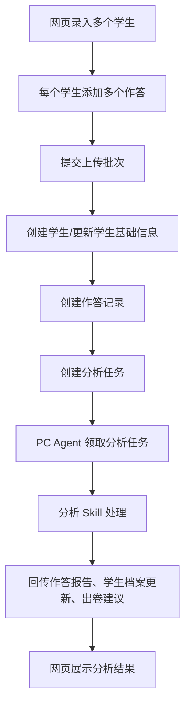
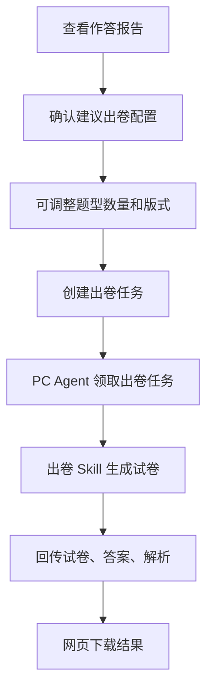
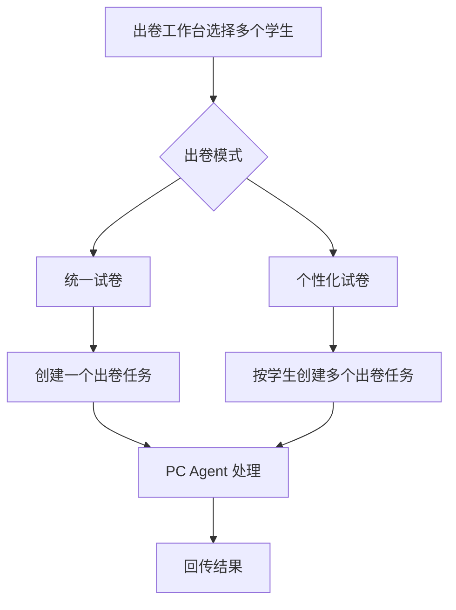

# Paper Analyzer PRD

## 1. 产品定位

Paper Analyzer 是一个自用的小班学生作答分析与针对性出卷系统。手机网页负责录入学生、上传作答图片、管理任务、查看报告和下载复习卷；家里 Windows PC 上的 Codex Agent 通过 MCP 领取分析或出卷任务，使用本机 Skill 完成图片理解、作答评价、学生档案更新建议、复习卷生成和文档渲染。

系统不直接在网页端调用大模型。网页端只负责数据管理、结构化任务创建和结果展示；智能处理都由 PC Codex Agent 完成。

## 2. 核心目标

- 支持一次上传多个学生、多个作答记录，每个作答记录可以有独立年级、学科和多张图片。
- 先完成分析任务，生成学生本次作答评价、优缺点、题型/版式识别结果和建议出卷数据。
- 分析完成后，可以按单个学生、单次作答、学生长期表现或批量学生创建出卷任务。
- 建立学生档案，记录学生所有作答、分析报告、复习卷和持续更新的综合评价。
- 建立全局试卷模板库，支持题型管理和模板管理，按学科区分常用题型和模板。
- 通过 MCP 用结构化数据连接服务器和 PC Agent，使分析 Skill 与出卷 Skill 可独立演进。

## 3. 产品边界

### 3.1 当前 Web 项目负责

- 默认单用户数据空间，底层保留 `ownerId` 字段，为未来用户隔离做准备。
- 学生管理。
- 作答上传。
- 分析任务管理。
- 出卷任务管理。
- 作答报告查看。
- 学生档案查看。
- 题型管理。
- 试卷模板管理。
- MCP Server：向 PC Codex Agent 暴露任务领取、数据读取和结果回传工具。

### 3.2 PC Codex Agent 负责

- 分析 Skill：拆解上传数据、识别题型/版式、分析学生作答、生成单次评价、输出学生档案更新建议和出卷建议。
- 出卷 Skill：根据模板、学生表现、作答记录或知识点范围生成复习卷、答案和解析。
- 文档渲染：生成 Markdown、DOCX、PDF 等结果文件。

### 3.3 暂不做

- 登录系统和多用户 UI。
- 复杂权限体系。
- 可视化试卷排版编辑器。
- 全量教材知识图谱的完整人工维护。
- 真实在线批改模型调用。

## 4. 关键设计决策

### 4.1 分析和出卷拆成两类任务

分析任务和出卷任务必须拆开：

- 分析任务可以批量处理多个学生和多个作答记录，目标是理解图片、拆解题型、评价作答、更新学生档案。
- 出卷任务以“生成一套复习卷”为最小单位，一套卷一个任务，便于失败重试、下载和历史追踪。

### 4.2 作答是核心事实记录

系统不以“试卷”作为唯一核心对象，而以 `Submission` 作答记录为核心。一个上传批次可以包含多个学生，每个学生可以包含多个作答记录。每个作答记录独立包含年级、学科、图片、分析结果和可选出卷建议。

### 4.3 学生姓名全局唯一

当前小班场景下，学生姓名全局唯一。系统不允许重名。如果需要区分同名学生，由使用者手动添加标识，例如“张三1”“张三2”。

### 4.4 学生年级自动上调

学生档案包含当前年级。每次上传作答时，如果作答年级高于学生当前年级，则自动将学生当前年级更新为更高年级；历史作答记录保留原始年级。

### 4.5 不做定量排名

系统不强调卷面分数。作答报告展示对错情况、整体表现、优点、不足、建议，不做排名，不以分数评价学生。若 Agent 能识别对错，可展示正确/错误/部分正确/无法判断，但不要求展示总分。

### 4.6 知识点管理采用渐进式

MVP 阶段按西安城六区教材版本内置小学和初中主要学科知识点库，并保留后续人工维护能力。采用混合策略：

- 系统内置按学科、年级段组织的知识点 JSON。
- 小学支持语文、数学、英语。
- 初中支持语文、数学、英语、物理、化学、生物、政治、历史、地理。
- 教材版本默认按西安城六区：小学语文/英语人教版、小学数学北师大版；初中语文/英语/政治/历史/生物人教版、数学北师大版、物理苏科版、化学科粤版、地理中图版。
- Agent 分析作答时可以回传新知识点。
- 用户可在知识点管理中合并、改名、停用知识点。
- 出卷时可选择年级、学科、知识点范围；若选择学生，可结合该学生过往评价自动推荐重点。

## 5. 核心对象

### 5.1 Student

学生档案。

字段：

- `id`
- `ownerId`
- `name`
- `currentGrade`
- `notes`
- `profileSummary`
- `strengths`
- `weaknesses`
- `trendSummary`
- `createdAt`
- `updatedAt`

规则：

- `name` 在同一 `ownerId` 下唯一。
- 每次分析任务完成后，Agent 可回传学生档案更新建议。
- 档案只保留一份当前综合评价；历史变化通过作答记录追溯。

### 5.2 UploadBatch

一次网页提交。

字段：

- `id`
- `ownerId`
- `title`
- `students`
- `analysisTaskId`
- `createdAt`

### 5.3 Submission

单个学生的一次作答记录。

字段：

- `id`
- `ownerId`
- `studentId`
- `studentNameSnapshot`
- `grade`
- `subject`
- `imageIds`
- `sourceBatchId`
- `analysisStatus`
- `analysisResult`
- `layoutSnapshot`
- `recommendedPracticePlan`
- `createdAt`
- `updatedAt`

说明：

- 一个学生可以有多个作答记录。
- 同一上传批次可以创建多个作答记录。
- `layoutSnapshot` 是 Agent 识别到的原作答题型和数量结构。

### 5.4 AnalysisTask

分析任务。

字段：

- `id`
- `ownerId`
- `status`
- `submissionIds`
- `createdAt`
- `claimedAt`
- `completedAt`
- `failedAt`
- `statusMessage`
- `resultSummary`

### 5.5 PracticeTask

出卷任务。

字段：

- `id`
- `ownerId`
- `status`
- `mode`
- `studentIds`
- `submissionIds`
- `templateId`
- `subject`
- `grade`
- `knowledgePointIds`
- `requirements`
- `resultFiles`
- `createdAt`
- `claimedAt`
- `completedAt`
- `failedAt`

`mode` 可选：

- `blank`：不绑定学生，按年级、学科、模板和知识点出卷。
- `student-profile`：按学生长期表现出卷。
- `submission`：按某次作答分析结果出卷。
- `batch-student`：为多个学生分别生成个性化试卷。
- `batch-unified`：为多个学生生成一份统一试卷。

### 5.6 QuestionType

题型定义。

字段：

- `id`
- `ownerId`
- `subject`
- `name`
- `description`
- `isSystem`
- `isActive`
- `createdAt`
- `updatedAt`

规则：

- 题型只要求名称；大模型根据名称理解具体题型。
- 支持按学科初始化常见题型。
- 用户可新增、编辑、停用自定义题型。

### 5.7 PaperTemplate

试卷模板。

字段：

- `id`
- `ownerId`
- `name`
- `subject`
- `gradeRange`
- `orientation`
- `sections`
- `createdAt`
- `updatedAt`

`orientation` 可选：

- `portrait`
- `landscape`

`sections` 示例：

```json
[
  {
    "id": "section-1",
    "name": "一、选择题",
    "questionTypeId": "choice",
    "questionTypeName": "选择题",
    "count": 10,
    "order": 1,
    "notes": "基础题为主"
  },
  {
    "id": "section-2",
    "name": "二、应用题",
    "questionTypeId": "word-problem",
    "questionTypeName": "应用题",
    "count": 5,
    "order": 2,
    "notes": "贴近日常场景"
  }
]
```

### 5.8 KnowledgePoint

知识点。

字段：

- `id`
- `ownerId`
- `subject`
- `gradeRange`
- `name`
- `parentId`
- `source`
- `isActive`

`source` 可选：

- `seed`
- `agent`
- `manual`

## 6. 页面设计

### 6.1 作答上传页

目标：在一个页面中录入多个学生和多个作答记录。

结构：

- 上传批次标题。
- 学生列表。
- 每个学生下可新增多个作答记录。
- 每个作答记录包含：
  - 年级
  - 学科
  - 图片列表
  - 补充说明
  - 是否在分析完成后提示创建复习卷

交互：

- 输入学生姓名时，使用可输入的 Select 组件联想已有学生名称；如果不存在则自动准备新增学生。
- 如果学生已存在，则使用已有学生并在分析完成后更新档案。
- 支持一个学生添加多个作答。
- 支持一个页面提交多个学生。
- 提交后创建 `UploadBatch`、多个 `Submission` 和一个 `AnalysisTask`。

验收：

- 不允许同名新建学生。
- 每个作答记录必须选择年级和学科。
- 每个作答记录至少上传一张图片。

### 6.2 任务管理页

目标：统一查看分析任务和出卷任务。

筛选：

- 任务类型：分析、出卷。
- 状态：等待、处理中、完成、失败。
- 学生。
- 学科。
- 时间。

任务详情：

- 任务基础信息。
- 关联学生。
- 关联作答。
- MCP 处理状态。
- 错误信息。
- 结果文件。

验收：

- 分析任务完成后可进入对应作答报告。
- 出卷任务完成后可下载试卷和答案。

### 6.3 学生管理页

目标：查看学生列表和综合档案。

列表字段：

- 姓名。
- 当前年级。
- 最近作答时间。
- 累计作答次数。
- 最近评价摘要。

详情页：

- 基本信息。
- 综合评价。
- 优势。
- 不足。
- 进步/下滑趋势。
- 作答历史。
- 已生成复习卷。
- 针对出卷入口。

规则：

- 学生档案评价由 Agent 在每次分析任务完成后回传更新。
- 档案只展示当前综合结论，历史单次评价保存在作答记录中。

### 6.4 作答报告页

目标：查看某个学生某次作答的分析结果。

展示：

- 学生、年级、学科、上传时间。
- 作答图片。
- 题目总数和题型结构。
- 对错概览。
- 本次优点。
- 本次不足。
- 建议复习方向。
- 建议出卷配置。
- 创建出卷任务按钮。

不展示：

- 总分。
- 排名。
- 复杂原图定位。

### 6.5 出卷工作台

目标：单独出卷、针对学生出卷、针对作答出卷、批量出卷。

模式：

- 空白出卷：选择年级、学科、知识点、模板。
- 按学生档案出卷：选择学生，系统带出学生长期优势/不足和推荐知识点。
- 按单次作答出卷：选择学生某次作答，系统使用该作答的分析结果和版式。
- 批量个性化出卷：选择多个学生，为每个学生生成一套个性化试卷。
- 批量统一出卷：选择多个学生，生成一套统一试卷。

关键规则：

- 如果基于某次作答出卷，默认使用该作答的 `layoutSnapshot`，题型和数量不自动变化。
- 如果使用模板出卷，则严格按模板的模块顺序、题型和数量生成。
- 用户可在创建出卷任务前动态调整题型模块、数量、顺序和版式。
- 一套卷创建一个 `PracticeTask`；批量个性化出卷会创建多个 `PracticeTask`。

### 6.6 题型管理页

目标：维护各学科常用题型。

功能：

- 按学科查看题型。
- 新增题型。
- 编辑题型名称。
- 停用题型。
- 恢复题型。
- 初始化常见题型。

小学/初中常见初始题型建议：

- 语文：字词基础、句子练习、阅读理解、古诗文、作文/片段写作、综合运用。
- 数学：口算、填空、选择、判断、计算、脱式计算、解方程、图形与几何、应用题、统计题。
- 英语：单词拼写、单项选择、完形填空、阅读理解、句型转换、补全对话、翻译、写作。
- 物理：选择、填空、作图、实验探究、计算、综合应用。
- 化学：选择、填空、实验探究、推断、计算、综合应用。
- 生物：选择、填空、识图、实验探究、简答。
- 历史/地理/政治：选择、材料分析、简答、综合探究。

### 6.7 试卷模板管理页

目标：按学科维护可复用试卷结构。

功能：

- 创建模板。
- 编辑模板名称、学科、适用年级、横版/竖版。
- 动态增删题型模块。
- 修改模块名称。
- 修改题型。
- 修改题目数量。
- 调整模块顺序。
- 复制模板。
- 停用模板。

验收：

- 模板必须至少包含一个模块。
- 每个模块必须选择题型并填写题目数量。
- 模板可用于出卷工作台。

## 7. MCP 任务设计

### 7.1 MCP 任务类型

`taskType`：

- `analysis`
- `practice-generation`

### 7.2 AnalysisTask 输入

PC Agent 获取分析任务时，服务器提供：

- 上传批次信息。
- 学生列表。
- 作答记录列表。
- 每个作答的年级、学科、图片 URL、补充说明。
- 当前学生档案。
- 当前题型库。
- 当前模板库。
- 当前知识点库。

### 7.3 AnalysisTask 输出

Agent 回传：

- 每个作答的分析结果。
- 每个作答的题型和数量识别结果。
- 每个作答的本次优点、不足、建议。
- 每个作答的对错概览。
- 每个学生的档案更新建议。
- 建议出卷数据。
- 可选知识点新增建议。

### 7.4 PracticeTask 输入

PC Agent 获取出卷任务时，服务器提供：

- 出卷模式。
- 学生档案。
- 关联作答记录。
- 分析结果。
- 模板或版式结构。
- 知识点范围。
- 用户补充要求。

### 7.5 PracticeTask 输出

Agent 回传：

- 试卷文件。
- 答案文件。
- 解析文件。
- 结构化出卷摘要。
- 关联学生和作答。

## 8. 推荐流程

### 8.1 上传并分析



### 8.2 基于分析结果出卷



### 8.3 批量出卷



## 9. MVP 里程碑

### M1：数据模型和任务中心升级

- 支持学生、作答、分析任务、出卷任务。
- 保留默认 `ownerId`。
- 支持任务类型拆分。
- 扩展 MCP 工具。

### M2：上传页和任务管理

- 上传页支持多个学生和多个作答。
- 任务管理区分分析和出卷。
- 作答报告可展示 Agent 回传结果。

### M3：学生管理

- 学生列表。
- 学生详情。
- 作答历史。
- 综合档案展示。

### M4：出卷工作台

- 空白出卷。
- 按学生档案出卷。
- 按单次作答出卷。
- 批量统一/个性化出卷。

### M5：模板库

- 题型管理。
- 试卷模板管理。
- 初始化常见学科题型。

### M6：PC Agent 文档和 Skill 交付标准

- 分析 Skill 输入输出协议。
- 出卷 Skill 输入输出协议。
- 自动化处理说明。
- 黄金样例调试建议。

## 10. 待后续决策

- 是否引入完整教材知识点库。
- 是否支持学生分组/班级。
- 是否需要给学生档案评价增加版本历史。
- 是否需要在网页端人工编辑 Agent 回传的分析结果。
- 是否需要将模板导出为可复用 JSON 文件。
